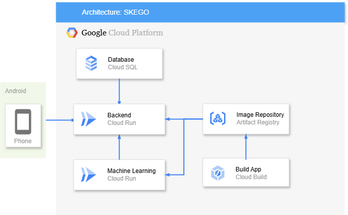

# 📅 Skego: Plan Smart Work Fast

## ✨ **Team Profile**
**Team ID**: **C242-PS022**

Team Member Names **Skego**:
- **(ML)** M284B4KX0441 – Alya Saphira – *Universitas Negeri Surabaya* 
- **(ML)** M284B4KX3366 – Nidya Aulia Adji Putri – *Universitas Negeri Surabaya* 
- **(ML)** M296B4KX0362 – Alfina Andriani – *Universitas Pembangunan Nasional “Veteran” Jawa Timur*
- **(CC)** C296B4KX0104 – Adinda Wira Zahra Tsabitah – *Universitas Pembangunan Nasional “Veteran” Jawa Timur* 
- **(CC)** C296B4KY1591 – Gastin Alfiansa – *Universitas Pembangunan Nasional Veteran Jawa Timur*  
- **(MD)** A296B4KX4568 – Yumna Kamilah Mahdiyah – *Universitas Pembangunan Nasional Veteran Jawa Timur*  
- **(MD)** A345B4KY2231 – Krisna Fajar Fahtur Rohman – *University of 17 Agustus 1945 Surabaya*

---

## 🌍 **Project Background**

### Context:
Academic procrastination has been a pervasive challenge among students, often rooted in poor time management. Research studies highlight the critical impact:

- **83.4%**: Academic procrastination due to time management issues (Arianti & Kumara, 2021).
- **81%**: Mental health variance linked to perceived workload (Syahid, A., et al., 2024).
- Students face challenges in managing time effectively, which negatively impacts academic performance, increases stress, and limits personal growth (Dalia, A.C., & Putra, F.R., 2023).

### Goal:
Skego empowers students with efficient scheduling tools to overcome procrastination and enhance academic achievements through structured time management.

---

## ☁ **Cloud Computing Architecture**

Below is the architecture design for Skego's backend, which leverages Google Cloud technologies for scalability and reliability:



### Highlights:
- **Compute**: Google Cloud Run for serverless backend.
- **Database Storage**: Cloud SQL.
- **APIs**: RESTful API endpoints deployed with high availability.

---

## 📊 **API Documentation**

### Localhost URL: `http://localhost:3000`
### Cloud RUN URL: `https://backend-skego-619804298613.asia-southeast2.run.app`

#### **Endpoints**:

- User
  <pre>POST    /api/users/Register</pre>
  <pre>POST    /api/users/Login</pre>
  <pre>POST    /api/users/change-password</pre>

- Task
  <pre>GET     /api/tasks?user_id=</pre>
  <pre>POST    /api/tasks</pre>
  <pre>PUT     /api/task/:id_task</pre>
  <pre>DELETE  /api/task/:id_task</pre>

- Routine
  <pre>GET     /api/routines?user_id=</pre>
  <pre>GET     /api/routines?user_id=&date_routine=</pre>
  <pre>POST    /api/routines</pre>
  <pre>PUT     /api/routines/:routine_id</pre>
  <pre>DELETE  /api/routines/:routine_id</pre>

- Generate
  <pre>GET     /api/generates?user_id=</pre>
  <pre>POST    /api/generates?user_id=</pre>

---

## 📢 **Environment Configuration**

To run this project locally, set up the following environment variables in a `.env` file:

```env
DB_HOST=(Public_IP_Cloud_SQL)   # Your Public IP Cloud SQL   
DB_USER=(DB_Username)           # Database Username Cloud SQL
DB_PASSWORD=(DB_Password)       # Database Password Cloud SQL
DB_NAME=(DB_Name)               # Database Name
DB_PORT=(DB_PORT)               # Port MySQL
```

---

## 🔧 **How to Run the Project**

1. **Clone the Repository:**
   ```bash
   git clone https://github.com/your-repo/skego-backend.git
   cd skego-backend
   ```

2. **Install Dependencies:**
   ```bash
   npm install
   ```

3. **Run Locally:**
   ```bash
   npm start index.js
   ```

---

## 🌟 **Credit**

Skego Cloud Computing Team.